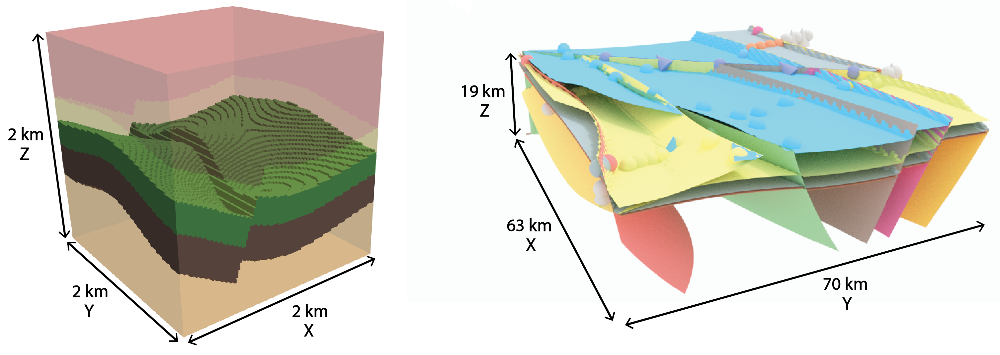

# GemPy

GemPy is an open-source tool for generating 3D structural geological models in Python (GemPy's code can be viewed in its repository: https://github.com/cgre-aachen/GeMpy.)
It is capable of creating complex 3D geological models,
including stratigraphic and structural features such as:

- fold structures (e.g.: anticlines, synclines)
- fault networks and fault-layer interactions
- unconformities

## Table of Contents

* [Examples](##Examples)
* [Getting Started](##GettingStarted)
    * [Prerequisits](###Prerequisits)
    * [Installation](###Installation)
* [Documentation](##Documentation)

## Examples

3D models created with GemPy may look like this:

The core algorithm is based on a universal cokriging interpolation method devised by
Lajaunie et al. (1997) and further elaborated by Calcagno et al. (2008).
Its implicit nature allows the user to generate complete 3D geological models
through the interpolation of input data consisting of:

- Surface contact points: 3D coordinates of points marking the boundaries between different features.
- Orientation measurements: Orientation of the poles perpendicular to the dipping of surfaces at any point in the 3D space.

GemPy also allows for the definition of topological elements such as stratigraphic sequences and fault networks to be considered in this process.

GemPy itself offers direct visualization of 2D sections via matplotlib
and in full 3D using the Visualization Toolkit (VTK). These VTK files can also be exported
for further processing in programs such as Paraview. GemPy can furthermore be easily
embedded in Blender for 3D rendering.

GemPy was furthermore designed to allow the performance of
Bayesian inference for stochastic geological modeling. This was achieved by writing GemPy's core algorithm
in Theano (http://deeplearning.net/software/theano/) and coupling it with PyMC3 (https://pymc-devs.github.io/pymc3/notebooks/getting_started.html).
This enables the use of advanced HMC methods and is of particular relevance when considering
uncertainties in model input data and the availability of additional secondary information.

We can, for example, include uncertainties with respect to the z-position of layer boundaries
in the model space. Simple Monte Carlo simulation via PyMC will then result in different model realizations:

 

This opens the path to...

((This optimization package allows the computation
of gradients opening the door to the use of advance HMC methods
coupling GeMpy and PyMC3 (https://pymc-devs.github.io/pymc3/notebooks/getting_started.html).
Also, the use of theano allows the use of the GPU through cuda (see theano doc for more information).)

For a more detailed elaboration of the theory behind GemPy, take a look at the upcoming scientific publication
"GemPy 1.0: open-source stochastic geological modeling and inversion" by de la Varga et al. (2018).

## Getting Started

### Prerequisits

GemPy requires `Python 3.X` and makes use of numerous open-source libraries:

* `numpy`
* `pandas`
* `matplotlib`
* `seaborn`
* `theano`

Optional:

* `vtk` for interactive 3-D visualization (VTK v. 7.X is required for Python 3)
* `skimage` and `networkx` for 3-D topology analysis and graph handling

Overall we recommend the use of a dedicated Python distribution, such as 
[Anaconda](https://www.continuum.io/what-is-anaconda), for hassle-free package installation. 
We are curently working on providing GemPy also via Anaconda Cloud, for easier installation of 
its dependencies.

### Installation

Installing the latest release version of GemPy itself is easily done using PyPI:

`$ pip install gempy`

Otherwise you can clone the current repository:

`$ git clone https://github.com/cgre-aachen/gempy.git`

And manually install it using the following command in the repository directory:

`$ python install.py`

## Documentation

Extensive documentation for GemPy is hosted at [gempy.readthedocs.io](http://gempy.readthedocs.io/),
explaining its capabilities, [the theory behind it](http://gempy.readthedocs.io/Kriging.html) and 
 providing detailed [tutorials](http://gempy.readthedocs.io/tutorial.html) on how to use it.
