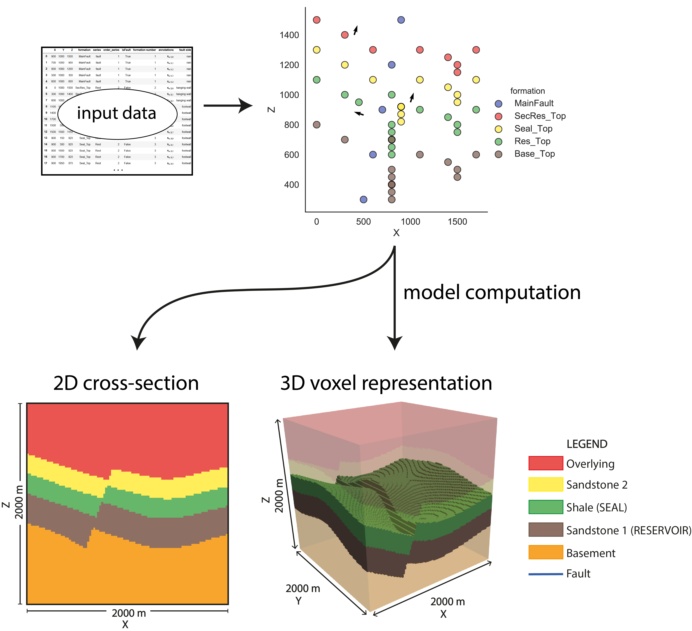

# GemPy

> Open-source, implicit structural geological modeling in 3D

 

*GemPy* is an Python-based, open-source library for implicitly generating 3D structural geological models. It is capable of 
constructing complex 3D geological models of folded structures, fault networks and unconformities.

## Table of Contents

* [Features](##Features)
* [Getting Started](##GettingStarted)
    * [Dependecies](###Dependecies)
    * [Installation](###Installation)
* [Documentation](##Documentation)

## Features

The core algorithm of *GemPy* is based on a universal cokriging interpolation method devised by
Lajaunie et al. (1997) and extended by Calcagno et al. (2008). Its implicit nature allows the user to automatically 
 generate complex 3D structural geological models through the interpolation of input data:

- Surface contact points: 3D coordinates of points marking the boundaries between different features (e.g. layer interfaces, fault planes, unconformities).
- Orientation measurements: Orientation of the poles perpendicular to the dipping of surfaces at any point in the 3D space.

*GemPy* also allows for the definition of topological elements such as combining multiple stratigraphic sequences and 
complex fault networks to be considered in the modeling process.

*GemPy* itself offers direct visualization of 2D model sections via matplotlib
and in full, interactive 3D using the Visualization Toolkit (VTK). The VTK support also allow to the real time maniulation
 of the 3-D model, allowing for the exact modification of data. Models can also easily be exportes in VTK file format 
for further visualization and processing in other software such as ParaView.

*GemPy* was designed from the beginning to support stochastic geological modeling for uncertainty analysis (e.g. Monte Carlo simulations, Bayesian inference). This was achieved by writing *GemPy*'s core architecture
using the numerical computation library [Theano](http://deeplearning.net/software/theano/) to couple it with the probabilistic programming framework [PyMC3](https://pymc-devs.github.io/pymc3/notebooks/getting_started.html).
This enables the use of advanced sampling methods (e.g. Hamiltonian Monte Carlo) and is of particular relevance when considering
uncertainties in the model input data and making use of additional secondary information in a Bayesian inference framework.

We can, for example, include uncertainties with respect to the z-position of layer boundaries
in the model space. Simple Monte Carlo simulation via PyMC will then result in different model realizations:

 

This opens the path to...

((This optimization package allows the computation
of gradients opening the door to the use of advance HMC methods
coupling GeMpy and PyMC3 (https://pymc-devs.github.io/pymc3/notebooks/getting_started.html).
Also, the use of theano allows the use of the GPU through cuda (see theano doc for more information).)

For a more detailed elaboration of the theory behind GemPy, take a look at the upcoming scientific publication
"GemPy 1.0: open-source stochastic geological modeling and inversion" by de la Varga et al. (2018).

## Getting Started

### Dependecies

GemPy requires `Python 3.X` and makes use of numerous open-source libraries:

* `numpy`
* `pandas`
* `matplotlib`
* `seaborn`
* `theano`

Optional:

* `vtk` for interactive 3-D visualization (VTK v. 7.X is required for Python 3)
* `skimage` and `networkx` for 3-D topology analysis and graph handling

Overall we recommend the use of a dedicated Python distribution, such as 
[Anaconda](https://www.continuum.io/what-is-anaconda), for hassle-free package installation. 
We are curently working on providing GemPy also via Anaconda Cloud, for easier installation of 
its dependencies.

### Installation

Installing the latest release version of GemPy itself is easily done using PyPI:

`$ pip install gempy`

Otherwise you can clone the current repository:

`$ git clone https://github.com/cgre-aachen/gempy.git`

And manually install it using the following command in the repository directory:

`$ python install.py`

## Documentation

Extensive documentation for GemPy is hosted at [gempy.readthedocs.io](http://gempy.readthedocs.io/),
explaining its capabilities, [the theory behind it](http://gempy.readthedocs.io/Kriging.html) and 
 providing detailed [tutorials](http://gempy.readthedocs.io/tutorial.html) on how to use it.
